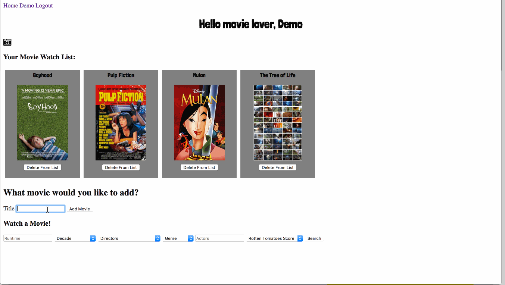

# ========== Now Playing at a Web Browser Near You ==========

Do you find yourself browsing Netflix more than watching net flicks? Does your list of new films to watch only grow as you pop in your VHS of Star Wars again? If this sounds like you, then you've come to the right place.

# ---------- WatchNext ---------- 

### WatchNext will help you eliminate the time spent surfing Netflix and Hulu and get to what matters most - watching films! 

* Add to and delete movies from a watch list with ease.
* Uses AJAX for dynamic adding/deleting of movie titles.
* Search specific parameters to filter through movies in watch list, for example: "I want to watch a movie that's less than 2 hours, is a Romantic Comedy from the 1980's, and has a Rotten Tomatoes score of at least 75."
* Send your watch list to your smart phone via SMS using the Twilio API to check your list on the go.
* Just select the options you want to filter and you'll find tonight's movie!

## Cast 📽️

* Ruby on Rails
* HTML5/SCSS/CSS3
* JavaScript/jQuery
* PostgreSQL
* [OMDB API](http://www.omdbapi.com)
* [Twilio API](https://www.twilio.com)

## Crew

* [Rspec](https://github.com/rspec/rspec-rails)
* [FactoryBot](https://github.com/thoughtbot/factory_bot_rails)
* [VCR](https://github.com/vcr/vcr)
* [DatabaseCleaner](https://github.com/DatabaseCleaner/database_cleaner)
* [Travis CI](https://github.com/travis-ci/travis.rb)

## Sneak Preview 🍿

## Test-Screenings 📼

The most recent deployment of WatchNext can be viewed at:

<http://what2watchnext.herokuapp.com/>

Play with the demo account:

  **Login:** demo@demo.com  
  **Password:** demo

## Contact the Director 🎬

Please direct all inquiries to: 

<http://jesse-calton.com>
